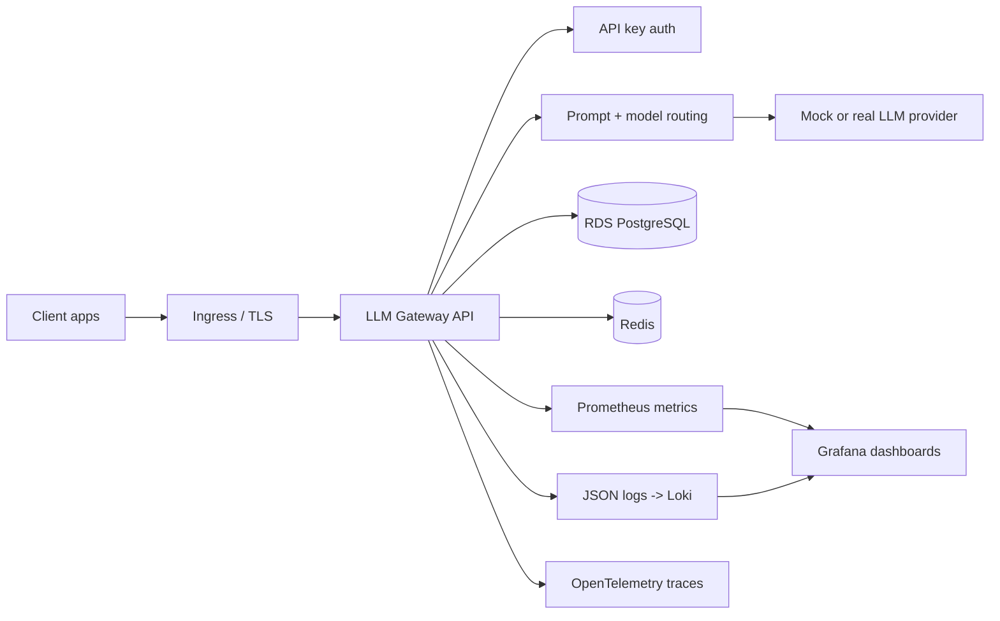

# Production AI Platform / LLMOps Infrastructure Platform

A production-style AI platform portfolio project for DevOps, cloud, platform, backend, full-stack, and LLMOps roles.

The app is intentionally scoped: a lightweight LLM gateway and usage dashboard. The main artifact is the production operating layer around it: Terraform, EKS, Helm, GitHub Actions, observability, secrets, rollback, security, reliability, cost controls, and runbooks.

## 60-Second Summary

This repository shows how I would operate AI workloads in production, not just how I would call an LLM API.

- Apps call a central LLM gateway instead of calling providers directly.
- The gateway handles API keys, prompt versions, model routing, request logs, latency, failures, token estimates, and estimated cost.
- The platform runs locally with Docker Compose and is packaged for Kubernetes with Helm.
- AWS infrastructure is defined with Terraform modules for EKS, ECR, RDS PostgreSQL, ElastiCache Redis, IAM, Secrets Manager, and optional budget alerts.
- CI/CD uses GitHub Actions for checks, image builds/scans, dev deploy, staging/prod promotion, and rollback.
- Observability includes OpenTelemetry traces, Prometheus metrics, Grafana dashboards, Loki log assets, alert rules, and incident runbooks.
- Safety controls include hashed API keys, rate limiting, non-root containers, NetworkPolicies, External Secrets, private data services, backups, rollback docs, and explicit production approval gates.

## Portfolio Positioning

This project complements **Proofbase**, the permission-aware enterprise RAG application.

- Proofbase proves the AI product layer: document workflows, retrieval quality, citations, permissions, memory safety, and answer-quality evaluation.
- Production AI Platform proves the operations layer: centralized model access, cost, latency, errors, traces, secrets, deployments, rollback, and cloud infrastructure.

The next planned integration sequence connects Proofbase as a client app through telemetry first: Proofbase keeps owning RAG, retrieval, citations, permissions, memory, and answer-quality evaluation, while this platform centralizes model usage, cost, latency, token, error, and request visibility. Gateway-routed provider calls can follow after the gateway supports Proofbase's richer provider contract.

## Target Portfolio Claim

> Built a production-grade AI platform on AWS using Kubernetes, Terraform, Helm, GitHub Actions, Prometheus, Grafana, Loki, OpenTelemetry, managed PostgreSQL, Redis, external secret management, staged deployments, rollback workflows, request tracing, cost monitoring, and reliability runbooks.

## What Is Implemented

Application:

- FastAPI LLM gateway
- Next.js usage dashboard
- PostgreSQL schema and Alembic migrations
- hashed API key authentication
- prompt versioning
- model routing
- mock LLM provider
- request logging
- cost, latency, token, and error tracking
- audit logs for prompt/model route changes
- rate limiting

Platform:

- Docker Compose local stack
- production Dockerfiles
- Terraform AWS modules for network, ECR, EKS, RDS, Redis, Secrets Manager, IAM, and budgets
- raw Kubernetes manifests
- Helm chart with dev/staging/prod values
- GitHub Actions CI, deploy, promotion, and rollback workflows
- optional Argo CD GitOps manifests
- OpenTelemetry tracing
- Prometheus metrics and alert rules
- Grafana dashboard JSON
- Loki/Promtail/log dashboard assets
- External Secrets integration
- security, reliability, incident, backup/restore, cost, and GitOps docs

## Architecture



See [docs/architecture-diagrams.md](docs/architecture-diagrams.md) for the deployment diagram and request lifecycle.
See [docs/gateway-flow.md](docs/gateway-flow.md) for a developer-focused walkthrough of the API key, project/app, prompt, routing, provider, logging, and cost-tracking flow.

## Local Demo

Start the local stack:

```bash
docker compose up --build
```

Run migrations and seed demo data:

```bash
make api-migrate
make api-seed
```

Open:

- Web dashboard: `http://localhost:3000`
- API health: `http://localhost:8000/health`

Send a gateway request with the local placeholder seed key:

```bash
curl -X POST http://localhost:8000/v1/gateway/completions \
  -H "Content-Type: application/json" \
  -H "X-API-Key: local-dev-placeholder-key-not-a-secret" \
  -d '{"input":"hello from local development"}'
```

The seed key is intentionally non-secret demo data and is stored only as a hash.

Useful commands:

```bash
make local-up
make local-down
make api-migrate
make api-seed
make api-test
make web-lint
make web-typecheck
make web-test
make check
make docker-build-prod
python scripts/smoke_load.py --requests 20 --concurrency 4
```

## Deployment Story

Default path:

1. CI runs backend lint/tests, frontend lint/typecheck/tests/audit, production image builds, dependency scans, image scans, repository scan, and infrastructure static checks.
2. Dev deploy can run automatically from `main` only when explicit repository variables enable it.
3. Staging deploy is manual.
4. Production deploy is manual and protected by the GitHub `prod` Environment approval gate.
5. Rollback is manual, requires a selected Helm revision, and includes rollout checks plus smoke tests.

Optional GitOps path:

- Argo CD AppProject and Application manifests live in `infra/gitops/argocd`.
- Applications point at the same Helm chart and dev/staging/prod values files.
- Dev can self-heal; staging and prod are manual sync.
- GitHub Actions and Argo CD should not both continuously control the same Helm release.

## Observability

Gateway requests emit:

- request ID and trace ID
- project/application context where safe
- selected provider/model
- latency
- status and error category
- estimated tokens and cost

Assets:

- `/metrics` Prometheus endpoint in the API
- `llm_gateway_*` cost, token, latency, request, error, auth, and rate-limit metrics
- Grafana overview, reliability, cost, and logs dashboards
- Loki/Promtail logging configuration
- OpenTelemetry request and gateway spans
- alert rules for errors, latency, 5xx, pod restarts, database availability, and cost spikes

See [docs/observability.md](docs/observability.md) and [docs/dashboard-screenshots.md](docs/dashboard-screenshots.md).

## Security, Reliability, And Cost

Security:

- no committed secrets
- hashed API keys
- non-root runtime containers
- read-only Kubernetes root filesystems
- dropped Linux capabilities
- NetworkPolicies
- External Secrets with AWS Secrets Manager
- GitHub OIDC deploy roles
- blocking supply-chain scans

Reliability:

- readiness and liveness probes
- graceful shutdown
- bounded provider retries and timeouts
- HPA and PDB manifests/templates
- rollback workflow
- backup/restore runbook
- incident response runbook

Cost:

- request-level estimated LLM cost
- cost summary endpoint and dashboard
- Prometheus cost metric and Grafana cost panels
- environment cost analysis
- optional AWS Budget Terraform module
- dev teardown guidance

See [docs/portfolio-summary.md](docs/portfolio-summary.md), [docs/security-baseline.md](docs/security-baseline.md), [docs/backup-restore.md](docs/backup-restore.md), and [docs/cost-analysis.md](docs/cost-analysis.md).

## Demo Path

Use [docs/demo-script.md](docs/demo-script.md) for the full walkthrough.

Recommended flow:

1. Show this README and architecture diagram.
2. Run the local stack.
3. Send a gateway request.
4. Show the web dashboard.
5. Show persisted request/cost/error data.
6. Show CI checks and image scanning.
7. Show Terraform modules.
8. Show Helm values and Argo CD manifests.
9. Show Grafana dashboard definitions and screenshot checklist.
10. Walk through rollback and incident simulation.

## Documentation Map

- [PROJECT_SPEC.md](PROJECT_SPEC.md): full project spec
- [AGENTS.md](AGENTS.md): autonomous phase workflow
- [phases.md](phases.md): phase roadmap
- [phases-progress.md](phases-progress.md): implementation log
- [docs/architecture.md](docs/architecture.md): architecture details
- [docs/architecture-diagrams.md](docs/architecture-diagrams.md): Mermaid diagrams
- [docs/gateway-flow.md](docs/gateway-flow.md): gateway request flow and code walkthrough
- [docs/external-telemetry-contract.md](docs/external-telemetry-contract.md): Proofbase-first external LLM telemetry contract
- [docs/deployment.md](docs/deployment.md): local, Kubernetes, Helm, CI/CD, rollback, GitOps
- [docs/ci-cd.md](docs/ci-cd.md): GitHub Actions CI jobs, actions, scanners, and deployment boundaries
- [docs/testing.md](docs/testing.md): validation commands
- [docs/terraform.md](docs/terraform.md): Terraform modules and state guidance
- [docs/observability.md](docs/observability.md): metrics, logs, traces, dashboards
- [docs/runbook.md](docs/runbook.md): operational runbook
- [docs/incident-response.md](docs/incident-response.md): incident process
- [docs/incident-simulation.md](docs/incident-simulation.md): demo incident scenario
- [docs/backup-restore.md](docs/backup-restore.md): backup, restore, RTO/RPO, DR assumptions
- [docs/secrets-management.md](docs/secrets-management.md): External Secrets and secret handling
- [docs/security-baseline.md](docs/security-baseline.md): security controls
- [docs/security-audit.md](docs/security-audit.md): audit log review
- [docs/cost-analysis.md](docs/cost-analysis.md): cost estimates and controls
- [docs/gitops-argocd.md](docs/gitops-argocd.md): optional Argo CD path
- [docs/dashboard-screenshots.md](docs/dashboard-screenshots.md): screenshot capture plan
- [docs/demo-script.md](docs/demo-script.md): interview/demo script
- [docs/portfolio-summary.md](docs/portfolio-summary.md): final bullets, summaries, limitations

## Known Limitations

- The provider integration is a mock provider by default; real paid provider calls require refreshed pricing, credentials, quota controls, and approval.
- Admin prompt/model endpoints are operator foundations, not a full production admin authorization system.
- Rate limiting is in-process for the portfolio baseline; multi-replica production would use Redis-backed distributed limits.
- Terraform is code-only until an approved apply creates real AWS resources.
- Argo CD manifests are optional and are not applied by default.
- Live Grafana screenshots are not committed because no approved live monitoring deployment exists in this repository; capture guidance is documented.
- Multi-region disaster recovery is documented as out of scope for this baseline.

## Status

The original 30 infrastructure/platform phases are implemented in code and documentation. Phases 31-40 now define the Proofbase telemetry integration sequence. Phase 31 defines the safe event contract, and Phase 32 adds the central external LLM telemetry ingestion API. Proofbase runtime emission is intentionally deferred to later phases. CI was kept green during the original phase loop, and the repository is packaged as a portfolio-grade production AI platform rather than a toy LLM app.
