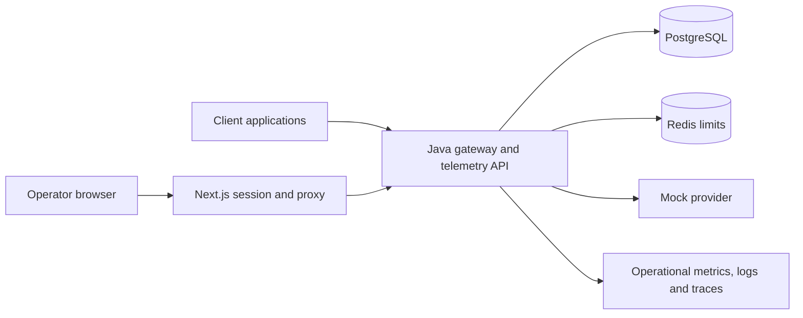

# Production AI Platform

A Java LLM gateway and usage dashboard, with the operations layer as the main
portfolio work: Terraform, Kubernetes, Helm, CI/CD, identity, observability,
immutable releases, rollback, recovery and cost controls.

**Current evidence:** tested locally and in CI. AWS is not deployed. Monitoring
runs as a preserved local prototype, but its final image set remains blocked by
[deferred vulnerabilities](docs/security/monitoring-vulnerability-backlog.md).
The remaining cloud scope is one explicitly approved AWS dev/demo environment;
staging and production configurations are optional and statically validated only.

## What you can inspect in one minute

- Java 21 / Spring Boot gateway with hashed application keys, prompt/model routing,
  request and cost records, PostgreSQL/Flyway and atomic Redis limits.
- OIDC operator access with database-backed viewer/operator project grants;
  the Next.js dashboard keeps tokens on the server and protects writes.
- Mandatory CI: Java/PostgreSQL/Redis integration tests, frontend/Python checks,
  full-history secrets, dependency/image scans, Terraform/Helm/Kubernetes checks,
  and an actual immutable OCI registry promotion round trip.
- A [measured local recovery rehearsal](docs/phase-reviews/phase-63.md): 20/20
  requests, p95 173 ms; dependency recovery, restart, compatible image rollback,
  and 24 request/cost records restored into a new PostgreSQL target.
- Separate application, migration and publisher identities; Terraform owns AWS
  load balancing, bootstrap owns TargetGroupBindings, and release jobs remain held.

## Synthetic dashboard preview


This is an actual local browser capture of **fixed synthetic fixtures**. It is
separate from gateway traffic, seeded databases, Proofbase/AgentOps telemetry and
monitoring. [Request detail and capture provenance](docs/assets/screenshots/phase-64.md)
identify the tested image, checks and limitations.

## Portfolio boundaries

| Project | Responsibility |
|---|---|
| Proofbase | Permission-aware RAG product, retrieval, citations and answer quality |
| AgentOps Workflow Platform | Agent workflows, steps, retries, generated outputs and tools |
| Production AI Platform | Gateway, safe usage telemetry, operational controls and infrastructure |

Proofbase and AgentOps are telemetry-first clients. They retain their own prompts,
content and execution. This platform accepts operational metadata; it does not run
RAG pipelines or workflows. Gateway routing for those clients is a future integration.

## Local demo

From a clean checkout with Docker running:

```sh
docker compose up --build
```

Compose runs the separate Flyway migration job, seeds placeholder local scopes,
and starts Java, PostgreSQL, Redis and the read-only synthetic dashboard. Open
[the dashboard](http://localhost:3000) and [API readiness](http://localhost:8000/health/ready).
All host ports bind to loopback. The Python service in `apps/api` is retained as a
compatibility reference; Java in `apps/api-java` is the default runtime.

Send one mock request:

```sh
curl -X POST http://localhost:8000/v1/gateway/completions \
  -H "Content-Type: application/json" \
  -H "X-API-Key: local-dev-placeholder-key-not-a-secret" \
  -d '{"input":"hello from local development"}'
```

The placeholder key is synthetic and stored as a hash. The response and database
show this request; the default synthetic dashboard stays fixed. To view actual
platform usage, configure [OIDC and project grants](docs/java-operator-security.md).
Unconfigured operator APIs are closed. Paid providers are not implemented in the
current gateway; unsupported routes are rejected.

Use [the concise demo script](docs/demo-script.md) and
[the repeatable local recovery commands](docs/local-recovery-rehearsal.md).
Local Docker shutdown retains database volumes; database deletion needs approval.

## Architecture and deployment boundary



Terraform defines EKS, ECR, RDS PostgreSQL, ElastiCache Redis, IAM, Secrets Manager,
networking and budgets. Helm packages the application and separate migration job.
Current release workflows are **manual and held**: they validate a full revision,
current CI provenance, immutable images/charts and schema compatibility before
separately protected publisher, migration and application jobs can execute.
Rollback selects a verified compatible release; it never downgrades the database.
See [immutable releases](docs/immutable-release-runbook.md) and [deployment](docs/deployment.md).

An approved private AWS dev/demo is sufficient for the portfolio. No production
SLA, high availability, multi-environment AWS operation or live cloud restore is
claimed. Phases 67–68 are skipped by owner scope decision. Phase 66 requires AWS
setup, Phase 62 completion, current required CI and explicit approval; Phase 69
has a separate publication approval; the owner selected MIT on 2026-09-16.

## Observability and recovery

Java emits operational JSON logs, bounded metrics and trace spans without request
content. Management metrics use `/actuator/prometheus` on private port 9080; they
are not a public application-port endpoint. CI checks metric, trace, privacy and
verified database/Redis TLS behavior.

The dated [Phase 62 prototype](docs/phase-reviews/phase-62.md) demonstrated populated
dashboards, searchable logs/traces and fired/resolved alerts. Final supported image
compatibility, delivery and monitoring CI remain unfinished. Legacy Promtail assets
are historical; the preserved Alloy proposal is not an eligible monitoring release.
No monitoring screenshot here is presented as current secure-release evidence.

[Phase 63](docs/phase-reviews/phase-63.md) restored exact local row hashes and proved
a new API write. Its latency/recovery timings are a small synthetic sample, not
AWS RTO/RPO, PITR or capacity measurements. Budgets notify; request quotas,
concurrency, scaling bounds and retention are separate cost controls.

## Verification and documentation

- [Testing](docs/testing.md), [CI/CD](docs/ci-cd.md), [phase progress](phases-progress.md)
- [Java runtime cutover](docs/java-runtime-cutover.md), [operator security](docs/java-operator-security.md)
- [Security review](docs/security/phase-64-review.md), [security policy](SECURITY.md), [contributing](CONTRIBUTING.md)
- [Architecture](docs/architecture.md), [TargetGroupBinding ownership](docs/targetgroupbinding-design.md)
- [Backup/restore](docs/backup-restore.md), [incident response](docs/incident-response.md), [cost analysis](docs/cost-analysis.md)
- [Proofbase integration](docs/proofbase-integration.md), [AgentOps integration](docs/agentops-integration.md)
- [AWS setup and blocked launch decision](docs/aws-launch-checklist.md), [priced dev/demo proposal](docs/cost-analysis.md)
- [Completion scope](docs/portfolio-completion-plan.md), [release decisions](docs/publication-decisions.md)

The project uses the [MIT License](LICENSE), selected by the owner on 2026-09-16.
Third-party dependencies and vendored materials retain their respective licenses.
The repository remains private, with no release published.
Historical phase reviews retain earlier runtime evidence; current claims follow
this README, the latest phase progress and the linked measured results.
