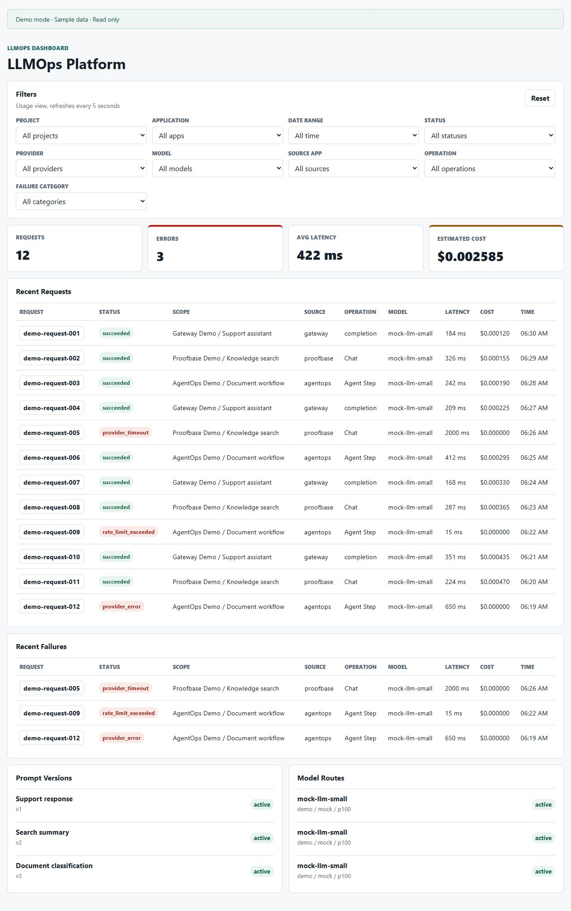
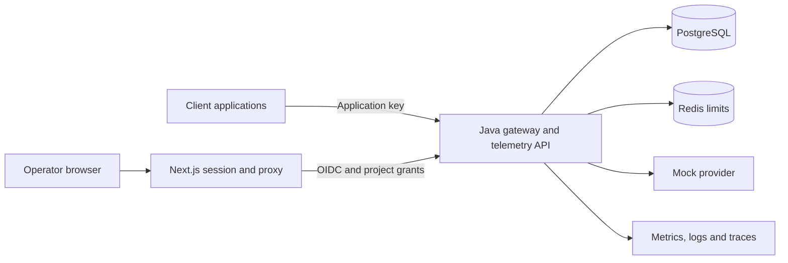

# LLMOps Platform

[](https://github.com/christiankfoury/llmops-platform/actions/workflows/ci.yml)
[](LICENSE)

An LLM gateway and operations dashboard with usage tracking, cost monitoring,
and reproducible cloud infrastructure.

**Java 21 · Spring Boot · Next.js · PostgreSQL · Redis · Terraform · Kubernetes · Helm**



*Actual local application capture in Demo mode, using read-only sample data.*
[View request details and filtering screenshots →](docs/dashboard-screenshots.md)

## What it demonstrates

| Capability | Implementation and evidence |
|---|---|
| Gateway and usage tracking | Hashed application keys, prompt/model routing, mock completions, request records, latency and estimated costs. [Gateway](docs/java-gateway.md) |
| Operator access | OIDC authentication, project-scoped viewer/operator grants, server-side sessions and protected writes. [Security design](docs/java-operator-security.md) |
| Delivery and supply chain | Required CI, dependency/image/secret scans, SBOMs, digest-verified OCI promotion and separate migration/application identities. [CI/CD](docs/ci-cd.md) |
| Infrastructure | Terraform for AWS; Helm/Kubernetes packaging; private data services, least-privilege identities and deployment holds. [Architecture](docs/architecture.md) |
| Recovery | Redis outage/recovery, application restart, compatible image rollback and PostgreSQL restoration into a separate target. [Measured rehearsal](docs/archive/phase-reviews/phase-63.md) |
| Operational visibility | Structured logs, bounded metrics and trace spans without request content; usage telemetry from client applications. [Observability](docs/observability.md) |

## Run locally

With Git and Docker Compose available:

```sh
git clone https://github.com/christiankfoury/llmops-platform.git
cd llmops-platform
docker compose up --build
```

Open [the dashboard](http://localhost:3000) and [API readiness](http://localhost:8000/health/ready).
Compose starts Java, its separate Flyway migration job, PostgreSQL, Redis and the web
application. Ports bind to localhost; the demo needs no cloud or provider credentials.

Send a mock completion in another terminal:

```sh
export LOCAL_DEMO_API_KEY=local-dev-placeholder-key-not-a-secret
curl -X POST http://localhost:8000/v1/gateway/completions \
  -H "Content-Type: application/json" \
  -H "X-API-Key: ${LOCAL_DEMO_API_KEY}" \
  -d '{"input":"hello from local development"}'
```

The API stores this request and returns its request ID and usage metadata. The
**default dashboard uses fixed sample data** and does not reflect that request.
To display API-backed usage, configure [operator sign-in and project grants](docs/java-operator-security.md).
The gateway currently implements a mock provider; no paid LLM calls are made.

Stop services with `docker compose stop`; database volumes are retained.
See [local setup](docs/deployment.md) for ports and troubleshooting, or follow the
[five-minute walkthrough](docs/demo-script.md).

## Architecture



Application and migration containers have separate responsibilities. Flyway owns
schema changes; application startup does not mutate the schema. Release workflows
verify immutable images, charts, CI provenance and schema compatibility before any
approved deployment. Rollback changes the application image, never downgrades data.

Proofbase and AgentOps are metadata-only telemetry clients. They retain their own
content, provider calls and execution; this platform does not implement RAG or run
agent workflows. [Integration boundaries](docs/architecture.md#client-integrations)

## Validation and current limits

- Java, frontend, Python reference, security and infrastructure checks run in CI.
  See [testing](docs/testing.md) for local commands and the CI badge for current status.
- The local recovery sample completed **20/20 requests**, measured **173 ms p95**,
  and restored **24 request/cost records** with matching row hashes. This is a small
  local rehearsal, not a capacity benchmark or cloud RTO/RPO claim.
- **AWS is not deployed.** Terraform and deployment configuration are statically
  tested; one bounded dev/demo deployment is planned. Separate staging/production
  configurations have not been exercised in AWS.
- **Monitoring finalization is incomplete.** Dated prototype evidence and
  [known monitoring vulnerabilities](docs/security/monitoring-vulnerability-backlog.md)
  remain documented. The monitoring release and AWS deployment are blocked.
- The screenshots show sample UI data, not live provider usage, Grafana or AWS.
  The project is not offered as a production service and makes no HA/SLA claim.

## Documentation

For **backend and AI engineering**, follow the [gateway](docs/java-gateway.md),
[authorization design](docs/java-operator-security.md),
[telemetry contract](docs/external-telemetry-contract.md) and [tests](docs/testing.md).

For **platform and DevOps engineering**, follow [CI/CD](docs/ci-cd.md),
[AWS ownership](docs/targetgroupbinding-design.md),
[observability](docs/observability.md) and the [recovery rehearsal](docs/local-recovery-rehearsal.md).

Start with the [documentation index](docs/README.md): architecture, local setup,
security, testing, releases, recovery and costs. Historical implementation notes are
kept in the [archive](docs/archive/README.md); [progress](phases-progress.md) distinguishes
completed work from remaining milestones.

[Contributing](CONTRIBUTING.md) · [Security policy](SECURITY.md) · [MIT License](LICENSE)
