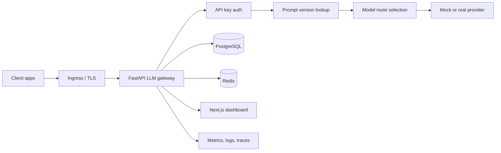
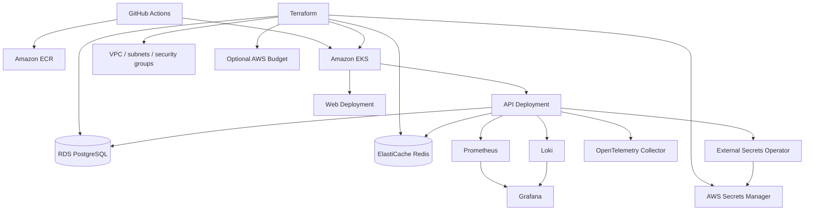
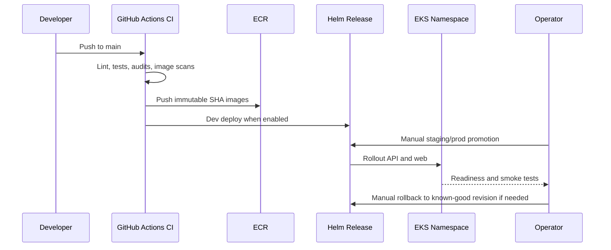
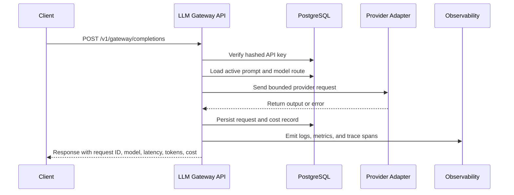

# Architecture Diagrams

## Logical Platform

```mermaid
flowchart LR
  client["Client apps"] --> ingress["Ingress / TLS"]
  ingress --> api["FastAPI LLM gateway"]
  api --> auth["API key auth"]
  auth --> prompt["Prompt version lookup"]
  prompt --> route["Model route selection"]
  route --> provider["Mock or real provider"]
  api --> db[("PostgreSQL")]
  api --> redis[("Redis")]
  api --> dashboard["Next.js dashboard"]
  api --> obs["Metrics, logs, traces"]
```

## AWS Deployment

```mermaid
flowchart TB
  github["GitHub Actions"] --> ecr["Amazon ECR"]
  github --> eks["Amazon EKS"]
  terraform["Terraform"] --> vpc["VPC / subnets / security groups"]
  terraform --> eks
  terraform --> rds[("RDS PostgreSQL")]
  terraform --> cache[("ElastiCache Redis")]
  terraform --> secrets["AWS Secrets Manager"]
  terraform --> budget["Optional AWS Budget"]

  eks --> api["API Deployment"]
  eks --> web["Web Deployment"]
  api --> rds
  api --> cache
  api --> secretsync["External Secrets Operator"]
  secretsync --> secrets
  api --> prom["Prometheus"]
  api --> otel["OpenTelemetry Collector"]
  api --> loki["Loki"]
  prom --> grafana["Grafana"]
  loki --> grafana
```

## Release And Rollback

```mermaid
sequenceDiagram
  participant Dev as Developer
  participant CI as GitHub Actions CI
  participant ECR as ECR
  participant Helm as Helm Release
  participant K8s as EKS Namespace
  participant Ops as Operator

  Dev->>CI: Push to main
  CI->>CI: Lint, tests, audits, image scans
  CI->>ECR: Push immutable SHA images
  CI->>Helm: Dev deploy when enabled
  Ops->>Helm: Manual staging/prod promotion
  Helm->>K8s: Rollout API and web
  K8s-->>Ops: Readiness and smoke tests
  Ops->>Helm: Manual rollback to known-good revision if needed
```

## Request Lifecycle

```mermaid
sequenceDiagram
  participant Client
  participant API as LLM Gateway API
  participant DB as PostgreSQL
  participant Provider as Provider Adapter
  participant Obs as Observability

  Client->>API: POST /v1/gateway/completions
  API->>DB: Verify hashed API key
  API->>DB: Load active prompt and model route
  API->>Provider: Send bounded provider request
  Provider-->>API: Return output or error
  API->>DB: Persist request and cost record
  API->>Obs: Emit logs, metrics, and trace spans
  API-->>Client: Response with request ID, model, latency, tokens, cost
```
