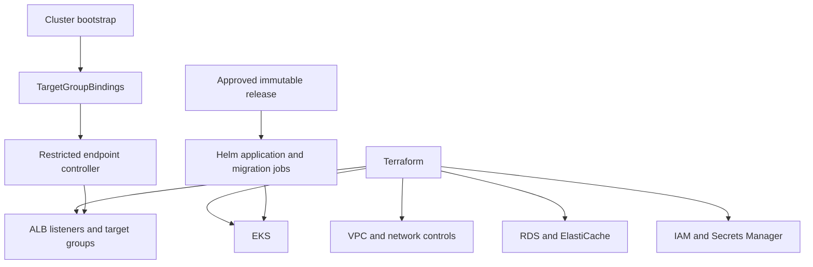

# Architecture diagrams

The [system architecture](architecture.md) explains current local behavior and the
unexecuted AWS design. These diagrams distinguish CI evidence from deployment.

## Delivery

```mermaid
sequenceDiagram
  participant Dev as Developer
  participant PR as Pull request
  participant CI as GitHub Actions
  participant GHCR as Private GHCR
  participant Ops as Operator
  participant AWS as AWS dev/demo (planned)
  Dev->>PR: Propose focused change
  PR->>CI: Required tests and scans
  CI-->>PR: Aggregate validation result
  PR->>CI: Merge; run exact-main-revision checks
  CI->>GHCR: Store and verify tested immutable images
  CI-->>Ops: Verified evidence, deployment not authorized
  Note over Ops,AWS: Deployment holds remain until prerequisites and approval
  Ops->>AWS: Separately approved release or compatible rollback
```

## Planned AWS ownership



AWS has not been deployed. The controller's restricted lifecycle and rendered
configuration are tested locally/in CI; live access, secret synchronization and
monitoring remain launch checks. [Ownership details](targetgroupbinding-design.md)
