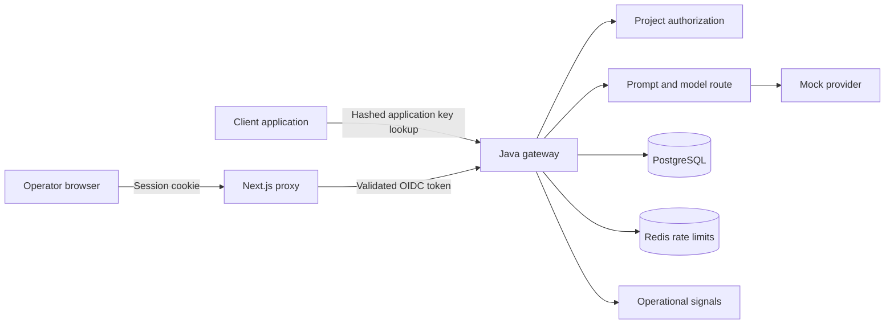

# Architecture

Java 21/Spring Boot is the default gateway and telemetry runtime. The Next.js web
application supplies a read-only synthetic demo or an authenticated operator view.
PostgreSQL stores configuration, grants, requests and costs; Redis enforces atomic limits.
The Python application remains a compatibility reference, not a second migration owner.

## Request and operator flows

A completion authenticates the application key, selects prompt/model configuration,
checks limits, calls the mock provider, and persists bounded usage/failure metadata.
No paid provider adapter is implemented. Unconfigured operator APIs are closed;
OIDC and database-backed viewer/operator grants control administrative access.
Browser mutations also require the existing origin/CSRF protections. Access tokens
remain server-side. [Operator security](java-operator-security.md)

The default synthetic view is a separate fixed fixture path with no API, database,
identity or provider connection. Its values are examples, not gateway measurements.
Authenticated mode uses the API through the same-origin proxy.

## Data and release ownership

Flyway runs through a separate migration image. The application does not own automatic
schema updates. Releases package API, migration and web images with verified OCI
metadata and charts. Current CI retains images privately in GHCR; the AWS registry
design uses ECR. Promotion verifies the tested digests, and compatible rollback does
not reverse database migrations. [Release design](immutable-release-design.md)

## AWS design: not yet deployed

Terraform defines VPC/networking, EKS, ECR, RDS PostgreSQL, ElastiCache Redis, IAM,
Secrets Manager and budgets. Terraform owns load balancers, listeners and target groups;
bootstrap owns TargetGroupBindings. The restricted controller registers endpoints,
without Ingress writes or load-balancer lifecycle permissions.

Helm packages workloads and migration execution; external secrets and separate
publisher/migration/application identities define the operational boundaries.
CI checks rendered manifests, Terraform and the controller's synthetic lifecycle.
These results do not establish live AWS operation. The intended cloud footprint is
one approved private dev/demo; staging/prod configurations remain optional static designs.
[Bootstrap design](targetgroupbinding-design.md) · [Launch checklist](aws-launch-checklist.md)

## Client integrations

Proofbase owns retrieval, citations and answer quality. AgentOps owns workflows,
agent steps and tools. They report operational metadata to this platform through
application-key authentication. Prompts, outputs, document content and tool payloads
stay with the client. Telemetry delivery is best-effort and must not break client work.
Their provider requests are not currently routed through this gateway.

## Monitoring and recovery

Java emits structured logs, metrics and trace spans. The monitoring prototype has
dated local evidence, but final image eligibility and compatibility remain unresolved.
See [observability](observability.md) and the [monitoring backlog](security/monitoring-vulnerability-backlog.md).
The [local recovery rehearsal](archive/phase-reviews/phase-63.md) measured a small load
sample, dependency recovery, restart/compatible rollback and an isolated database restore.
