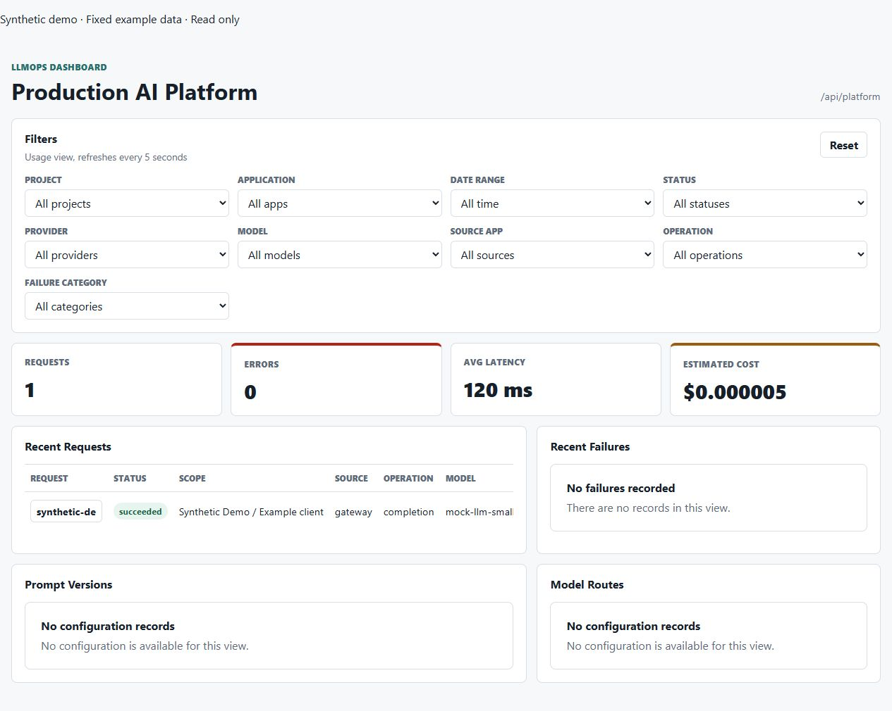
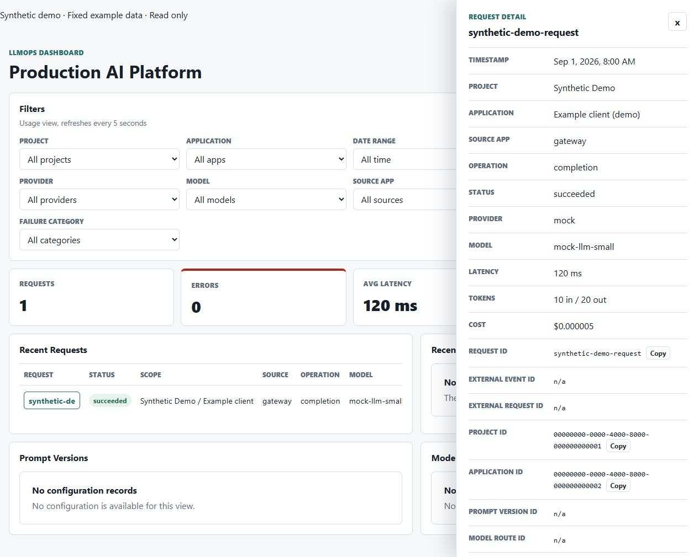

# Phase 64 synthetic browser captures

Captured and visually checked on 2026-09-08 in the local browser at
`http://localhost:3005`, from unchanged web sources at
`d03a9c166f2e4efb1ceebda540b1c7e567da794f` (also unchanged at the Phase 63 closeout).
Image ID: `sha256:2bef6ea2a4b8245b0a3b94e7df8923157ce0f95c4739f63832fd4b822a2fd50c`.
Both are unedited original JPEG captures, 1265 × 1010; hashes and checks are in
[the evidence record](../../archive/phase-reviews/phase-64-evidence.json).

The banner identifies fixed read-only example data. The fixture is one invented
request dated September 1: 120 ms, 10 input/20 output tokens and USD 0.000005.
These values are fixture constants, not Phase 63 load measurements or real charges.
Empty configuration/failure panels are intentional fixture content.

The Docker container bound only to 127.0.0.1, ran with a read-only root and all
capabilities dropped, and used `WEB_AUTH_MODE=synthetic_demo` with an intentionally
unreachable `API_BASE_URL=http://127.0.0.1:9`. There was no API/database/provider
connection. GET fixture checks passed; admin POST/PATCH returned 403; key listing
returned 404; an unmatched project returned zero fixture requests. No customer
telemetry, credentials, real operator identity or monitoring prototype data appears.

To reproduce, build the clean `apps/web/Dockerfile`, run its image locally with
those settings and open the synthetic request in the browser. Preserve the
visible fixture banner and record the actual image/revision; do not replace it
with a generated screenshot or present it as AWS/monitoring/authentication evidence.
