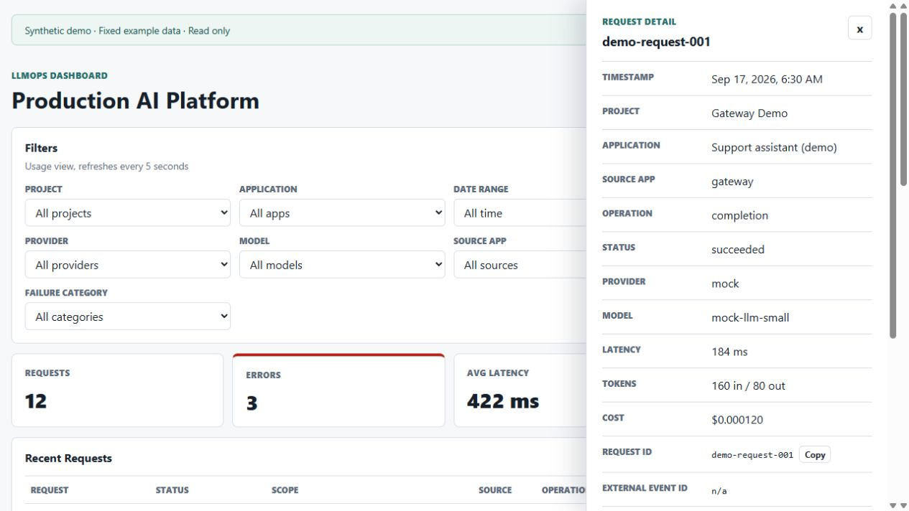
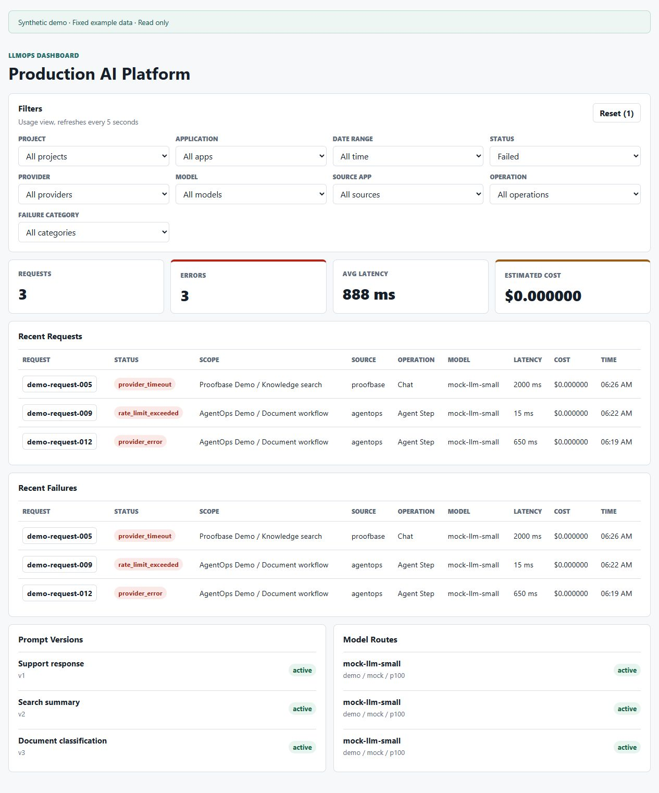

# Application screenshots

These are actual local browser captures of the production-built Next.js application,
using fixed invented fixtures. The default demo contains 12 requests across three
application scopes, including three failures and corresponding configuration records.
No backend, database, identity provider or paid LLM service supplies the example data.

## Overview

## Request details

## Failure filtering

The examples have fixed September 17, 2026 timestamps. Use **All time** to view the
whole fixture set; relative date filters can legitimately return no rows later.
The Status selector filters requests and summary totals; the failures panel
always shows failed rows within the other selected filters, matching the Java API.
Counts, averages and costs derive from the displayed fixture dataset, not actual
provider charges or the measured local recovery sample.

[Capture provenance](assets/screenshots/publication-capture.json) records source
hashes, viewport and image hashes. [Original September 8 captures](assets/screenshots/phase-64.md)
remain as historical evidence. Neither gallery demonstrates Grafana or AWS operation.

## Reproduce

Start the default Compose stack and open the web dashboard. Confirm its
**Synthetic demo · Fixed example data · Read only** notice. Capture the overview,
open `demo-request-001`, then close the details and set Status to `failed`.
Use a 1280 by 720 desktop viewport (the final capture dimensions) and preserve the notice. Inspect mobile layout
separately. Do not edit screenshot content or substitute generated images.
